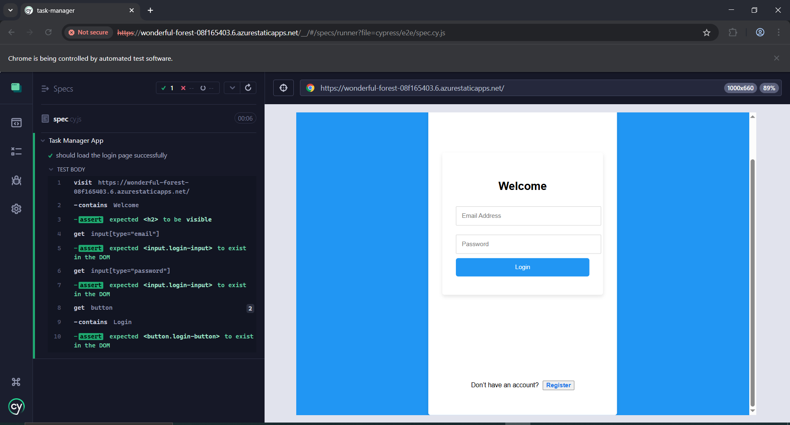

## Testing Report

## Overview

This document details the testing procedures and results conducted for the Task Manager web application. Three main types of testing were performed:

- Manual Testing

- Unit Testing

- End-to-End (E2E) Testing

Each testing type aimed to ensure that the application is functional, reliable, and user-friendly before deployment.

## Manual Testing

- **Description**

Manual testing was conducted by interacting directly with the deployed web application to verify its functionality and user experience.

Actions Performed

Visited the Login Page.

Tested login functionality by entering valid and invalid credentials.

Verified the "Don't have an account? Register" navigation.

Checked task addition, task deletion, and task completion toggling.

Verified logout functionality.

Result

✅ All major functionalities were successfully verified manually without any unexpected behavior.

## Unit Testing

- **Description**

Unit testing was performed using React Testing Library and Jest to ensure that individual components function correctly.

- Focused Component

- Login Component

- Actions Performed

Verified that the email input, password input, and login button were rendered correctly.

Result

✅ The Login component unit test passed successfully.

## End-to-End (E2E) Testing

- **Description**

E2E testing was conducted using Cypress to simulate a real user experience from accessing the application to interacting with form elements.

Actions Performed

Visited the deployed URL: https://wonderful-forest-08f165403.6.azurestaticapps.net/

- Confirmed that the "Welcome" message appeared.

- Verified the presence of email and password input fields.

- Verified the presence of the login button.

Result

✅ The E2E test passed successfully. All elements loaded as expected.

Conclusion

All three levels of testing (Manual, Unit, and E2E) confirmed that the Task Manager application is functional, reliable, and ready for production use.

Further continuous integration (CI) pipelines could be added in the future for automated test runs on every update.
